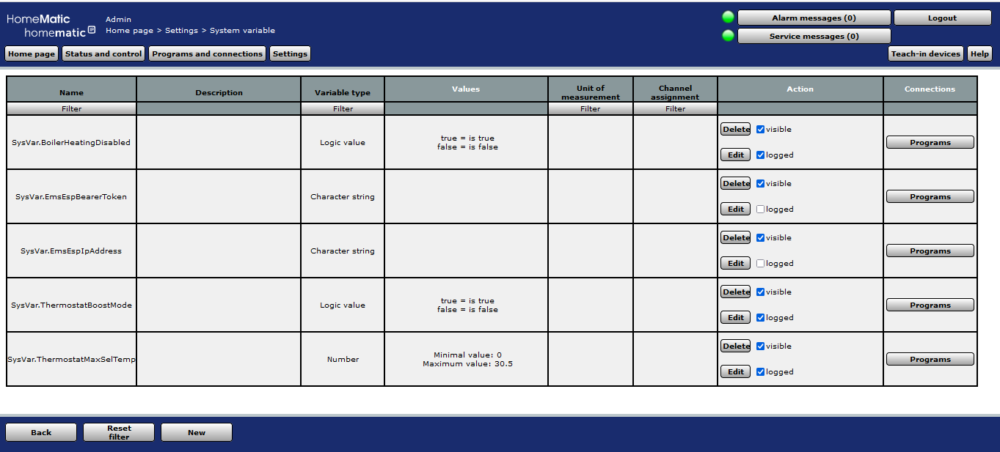

# EMS-Homematic-Integration
This project implements the communication between the Homematic smart thermostats and the Bosch boiler.
The information provided by the project can be used to understand/implement other use cases for the interaction between the Homematic devices and a boiler equipped with the EMS Bus.

# Use Cases
Using the communication I implemented the following use cases:
- put thermostats into a passive mode if the boiler heating is off
- switch the boiler into the boost mode if one of the thermostats is switched into the boost mode
- adjust the boiler's heating temperature to the temperature selected on the thermostats

# Overview
 
The CCU2 communicates with the thermostats over the proprietary Homematic 866 mHz protocol. 
The CCU2 is connected to the home network over the Ethernet cable.
The EMS-ESP module is connected to the home network over the WiFi.
The EMS-ESP module communicates with the boiler and its controller using the EMS Bus.
The scripts on the CCU2 communicate with the EMS-ESP over the home network using the EMS-ESP's REST API.
The use cases are implemented on the CCU2 using the Homematic scripting language. 

# EMS Bus 
The EMS Bus is a proprietary hardware protocol for the communication between Bosch/Junkers/Buderus boilers an their external devices like displays or thermostats. 
It is closed source but it was reverse engineered by the community. 

# EMS-ESP module
The EMS-ESP module https://github.com/emsesp/EMS-ESP32 implements the access to the EMS Bus from the network.
It has a web based user interface to view/change the boiler setting.
But there is also a REST API to access to the settings by any other applications connected to the same network.

## Hardware
There are ready to use hardware modules sold by https://bbqkees-electronics.nl/ but I wanted to build my own one to have a better understanding how it works.

The basic circuit schematic is taken from the [Archived EMSESP8266 project](https://github.com/dimitri-rebrikov/EMS-ESP/blob/1.9.4/doc/schematics/Schematic_EMS-ESP.png).

I adapted the circuit to be supplied by the power from the VCC+ pin of the EMS power jack of the boiler.
And I used ESP32 instead of ESP8266 as the current EMS-ESP version does not support the ESP8266 anymore.
Here is the circuit diagram with the adaptions:

I also used slightly different hardware parts, see the [Bill of Material](https://html-preview.github.io/?url=https://github.com/dimitri-rebrikov/EMS-Homematic-Integration/blob/main/BOM.xhtml).

During the implementation I split the circuit into 3 hardware modules: 

Each module is separate circuit board of nearly the same size.
They assembled together as a stack using the brass distance sleeves respective thick soldering wires. 
The assembly is put into a standard electronic distribution box:

  
   
  

## Software
The [EMS-ESP project](https://github.com/emsesp/EMS-ESP32) provides ready-to-use software for the EMS-ESP module.
To use the software:
1. install the software using the online install tool on https://install.emsesp.org/. The online installation will work only on the browsers supporting the serial interface (Chrome - yes, Firefox - not)

2. integrate the module into your WiFi network using explanations from https://emsesp.org/Configuring/

3. connect the module to the boiler over the 3.5mm service jack

4. access the user interface of the module over browser and test if the module can communicate with the boiler

5. copy the user access token from the security settings to be used later in the scripts for the write operations

# Thermostats
I have 2 types of the Homematic thermostats:
- Homematic HM-CC-RT-DN
- Homematic IP HMIP-eTRV/2

In order to work with the project the thermostats needs to be paired with the CCU. For the paring and other details just google for the "manual" and the type name of the corresponding thermostat.
After the paring the status values of the thermostat can be viewed/changed over the CCU either over the user interface or by a script.

# Use Cases implementation
The user cases logic is implemented as several scripts.
All scripts have following in common: They
- run on the CCU
- implemented in Homematic script language
- follow the separation of concern rule: They don't speak to the both sides - thermostats and boiler but only the one of them. I.e. if the use case involves both sides it is implemented using 2 scripts.
- use the CCU system variables to store the detected state so it can be used by another script 
- use the CCU system variables to read the state detected by another script
- use CCU object model to access the thermostat values
- use cURL (provided by CUxD) to access the boiler values

## Use Case "Send selected temperature to boiler"
The necessity of this use case is based on the fact that the modern power saving boiler adjusts their heating mode based on the desired room temperature. So it might be challenging to heat up your bath room up to 24 degree Celsius even with the thermostat set to this value if the boiler is internally set to 20 degree desired room temperature. Because the boiler adjusts the inflow water temperature for the heating pipes based on the desired room temperature. And boiler might just to stop heating the heating pipe water if the backflow water temperature reaches a value it "thinks" is enough to heat the room to 20 degree. So it is important to let the boiler "know" what is the actual desired room temperature.

The use cases is implemented by the following workflow:
- iterate over all thermostats every 10 sec
  - detect the max desired room temperature selected on the thermostats 
  - store the max desired room temperature in a system variable
- send the stored max desired room temperature to the boiler every 10 sec

The CCU elements used in the use case:
- the CCU function `ThermostatList` stores the list of the thermostats to iterate
- the CCU script [Prog.ReadThermostatStatus.txt](./Prog.ReadThermostatStatus.txt) implement the detection of the desired temperature and storing it
- the CCU system variable `SysVar.ThermostatMaxSelTemp` preserves the current desired temperature
- the CCU script [Prog.SendMaxSelTempToBoiler.txt](./Prog.SendMaxSelTempToBoiler.txt) sends the desired temperature to the boiler
- the CCU systems variables `SysVar.EmsEspIpAddress` and `SysVar.EmsEspBearerToken` contain the connection parameters for the EMS-ESP REST API 

## Use Case "Send boost to boiler"
This is a convenience feature implemented both in the Homematic thermostats and in the Bosch boiler controller.
In the thermostats it result in the full opening of the valve for a configured amount of time. In the boiler controller it result to setting the boiler to the configured "boost" temperature (f.e. 30 degree) for a configured amount of time. But without synchronization between thermostats and boiler this feature pretty useless. So opening the valve on the thermostat will not result the boiler switching into the hight power mode. The boiler will still try to keep the configured temperature by controlling the return water temperature and cancelling heating if the water becomes to hot. And vice versa: switching the boiler into the boost mode will use nothing if the valve of the thermostat is close as it configure to keep the normal room temperature. 

The use case implements the following workflow:
- iterate over all thermostats every 10 sec
  - check if any of the thermostat is put into the boost mode 
  - store the result of the flow in a system variable
- depending on the stored result enable/disable the boiler's boost mode every 10 sec

The CCU elements used in the use case:
- the CCU function `ThermostatList` stores the list of the thermostats to iterate
- the CCU script [Prog.ReadThermostatStatus.txt](./Prog.ReadThermostatStatus.txt) implement the check for the thermostats boost mode and storing it
- the CCU system variable `SysVar.ThermostatBoostMode` preserves the last result of the thermostats boost mode check
- the CCU script [Prog.SendBoostModeToBoiler.txt](./Prog.SendBoostModeToBoiler.txt) enables/disables the boost mode of the boiler
- the CCU systems variables `SysVar.EmsEspIpAddress` and `SysVar.EmsEspBearerToken` contain the connection parameters for the EMS-ESP REST API 

## Use Case "Send boilers heating disabled status to the thermostats"
The boiler is equipped with an outdoor temperature sensor. Based on the configured outdoor temperature threshold the boiler enables/disables the heating function. If the heating function of the boiler is disabled there is no reason for the thermostats to provide any kind of reaction to the temperature. They can be put into the "valve is always on" mode preventing battery drain from the valve motor actions but also preventing the valves from corrosion.

The use case implements the following workflow:
- check if the boiler heating is disabled every 10 sec
- stores the result of the check into a system variable
- iterates over all thermostats every 10 sec and set/unset the "valve is always on" mode depending on the result of the heating mode check

The CCU elements used in the use case:
- the CCU script [Prog.ReadBoilerHeatingDisabled.txt](./Prog.ReadBoilerHeatingDisabled.txt) implements the check if the boiler heating is disabled and stores the result into a system variable
- the CCU systems variables `SysVar.EmsEspIpAddress` contains the connection parameter for the EMS-ESP REST API 
- the CCU system variable `SysVar.BoilerHeatingDisabled` contains the last result of the boiler heating disabled check
- the CCU function `ThermostatList` stores the list of the thermostats to iterate over
- the CCU script [Prog.WriteThermostatHeatingDisabled.txt](./Prog.WriteThermostatHeatingDisabled.txt) iterates over thermostats and enables/disables the "valve is always on" mode

## Configuring the CCU elements
### Overview of the scripts

### Configuring 10 sec interval for the scripts

### Example of the thermostat list

### Overview of the system variables

# CUxD
CUxD is a software extension for the CCU and shall be installed for this project as it provides the cURL tool which is used by the scripts to access the boiler values over the EMS-ESP REST API. See the [Home Page](https://homematic-forum.de/forum/viewtopic.php?t=15298) for documentation and installation instruction.

# External Sources
- https://github.com/emsesp/EMS-ESP/blob/541c0c2e10b30098e26656a97a1686c8d44bc3bd/README.md
- https://github.com/bbqkees/Nefit-Buderus-EMS-bus-Arduino-Domoticz/blob/9a028393e1c5bedbde9ec8262f618dd6cc0af2ec/Documentation/README.md
- https://web.archive.org/web/20240222073926/https://www.kabza.de/MyHome/EMSBus/EMSbus.php
- https://docs.espressif.com/projects/esp-idf/en/v5.3.1/esp32s3/hw-reference/esp32s3/user-guide-devkitc-1.html
- https://www.debacher.de/wiki/Programmierung_bei_Homematic